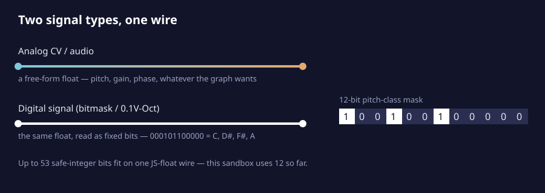

<div align="center">


# 🔌 soemdsp-sandbox — Digital Signals

*A fork of [soemdsp-sandbox](https://github.com/soundemote/soemdsp-sandbox) exploring one idea:*
**every wire in this patcher already carries a single JavaScript float — what if some of them carried *bits* instead of a voltage?**

[](LICENSE)
[](native_modules)
[](public)
[](#)
[](#)

</div>

<div align="center">

## 🖤 `beauty = binary * chaos`


*Two renderings of the same signal, one negative of the other — order and its inverse,*
*both true at once. That's the whole thesis of this repo in one image.*

📌 Original post: [bsky.app/profile/soundemote.bsky.social/post/3mk3zh2zwyk2p](https://bsky.app/profile/soundemote.bsky.social/post/3mk3zh2zwyk2p)

</div>

---

## 📖 Contents

- [`beauty = binary * chaos`](#-beauty--binary--chaos)
- [What's a "digital signal"?](#-whats-a-digital-signal-here)
- [Lossy by design](#-lossy-by-design)
- [What's built here](#-whats-built-here)
- [Where this can go](#-where-this-can-go)
- [Running it](#-running-it)
- [License](#-license)

---

## 💡 What's a "digital signal" here?

Zero and one are the two smallest true things in the world, and everything in this
repo is what happens when you take that seriously.

Every existing wire in the sandbox is **analog** by convention — a continuous control
voltage or audio signal riding on a single float. A **digital signal** is that *same*
float, loved differently: as a fixed-width integer whose individual bits each mean
something. Twelve booleans (*is C held? is C♯ held? …*) packed into one number, riding
one wire, instead of twelve separate gate wires. One float, secretly a small constellation
of on/off truths.

> This isn't a hack bolted onto the CV system — it's a second signal type that was
> always possible, hiding inside the same "one wire, one float" mechanism the whole
> graph already runs on. The bits were always there. We just started asking the wire
> what it actually knew.

<div align="center">

</div>

### 🧮 The math behind it

A JS double safely represents integers up to `2^53 − 1` before precision loss
(`Number.MAX_SAFE_INTEGER`).

| Quantity | Value |
|---|---|
| Safe bits on one wire | **53** |
| Possible states | **9,007,199,254,740,992** |
| Bits used today (pitch-class mask) | 12 |
| Bits left on the table | **41** |

Digital signals get a **white wire** in the graph — visually distinct from the usual
role-colored analog wires (🔵 cyan input, 🟠 amber output, 🟣 purple modulation).
Colors only — no change to wire shape, dashing, or animation.

---

## ♻️ Lossy by design

The most useful digital signal built so far — the 12-bit pitch-class mask — is
deliberately **lossy**: it throws away *which octave* a note came from and keeps only
*which pitch class*. That's not a limitation, it's the point. Binary doesn't need to
remember everything to be beautiful — it needs to remember the *right* things, and let
the rest go.

> A signal that keeps exactly the bits a listener needs, and discards the rest, is
> more useful than one that insists on exact reconstruction.

And the inverse is just as true, which is the whole reason the image above exists:
the same tangle of order, rendered white-on-black and black-on-white, is still the same
tangle. A bit doesn't care which of its two states you call "on." Chaos and structure
are two photographs of the same signal, and binary is what lets you develop either one.

---

## 🧩 What's built here

| Module | What it does |
|---|---|
| 🎛️ **Turing Machine** | Classic mutating shift-register sequencer. Each clock edge shifts its register and randomly flips the new bit at a set probability, producing evolving, semi-repeating loops. Exposes its low 12 bits as a `Scale` output. |
| 🎹 **Pitch Quantizer** | Snaps a `0.1V/Oct` pitch signal to the nearest note in a scale. Pick a preset (Chromatic, Major, Minor, Major/Minor Pentatonic, Whole Tone) or feed it a `Scale` mask directly — same bit convention, no adapter needed. |
| 🎼 **Chord Sequencer** | Steps through one of six built-in diatonic progressions (I–V–vi–IV, ii–V–I, …) on each clock edge. Outputs the current chord as a `Scale` mask, its root as `Root` (`0.1V/Oct`), and a `Gate`. Native C++/WASM. |
| 🧠 **Chord Memory** | Latches up to four notes from a single mono pitch source, one at a time, via a `Latch` trigger. Outputs them stacked or arpeggiated — built to sidestep needing real keyboard polyphony, which this sandbox doesn't have yet. |
| ⚡ **`0.1V/Oct`** | Not a bitmask, but the other sense of "digital": a fixed, quantized representation (`semitone = value × 120`) rather than a free-form analog voltage. Every `0.1V/Oct` port in the sandbox gets the same white wire. |
| 🌀 **Henon Map · Chua Attractor · Logistic Map** | The chaos generators that led here. Native WASM with a JS fallback, each verified against its real compiled artifact (randomized sweeps, bounded-output checks, exact iteration-count matching) before being wired into the graph. |

**Quick melodic patch:** `Chord Sequencer.Scale` → `Pitch Quantizer.Scale`, and
`Chord Sequencer.Root` → `Pitch Quantizer.0.1V/Oct`. Clock it, pick a progression,
and you've got a chord-anchored melody scaffold in two wires.

---

## 🚀 Where this can go

A digital signal is just bits, which means corrupting it on purpose is just math —
filtering, mangling, and glitching become **first-class operations** instead of edge
cases:

- 💥 **Bit Crusher** — AND against a random/shrinking mask; notes vanish and reappear unpredictably.
- 🦠 **Bit Rot** — a standalone corruption module for *any* digital signal: each clock tick, a chance to permanently flip one more bit.
- ⚔️ **XOR Collision** — combine two digital signals; get exactly the bits present in one but not the other.
- 🪞 **Bit Reverse** — mirror the bit order for an instant, unrelated-feeling variation on the same signal.
- 💣 **Popcount Detonator** — count the set bits; cross a threshold, fire a trigger. Chaos with a consequence.

None of this works on a continuous CV wire. It only exists because the signal is
discrete bits you're allowed to mangle.

> 🥁 **Coming later:** a rhythm-generator counterpart sending multichannel timing
> (a 4- or 8-track impulse), plus a step-sequencer counterpart, both speaking the
> same digital-signal convention.

---

## ▶️ Running it

```powershell
# Requirements: Python 3, a modern browser. No package install needed.

git clone https://github.com/elanhickler/soemdsp-sandbox-digital-signals-audio.git
cd soemdsp-sandbox-digital-signals-audio

python server.py
# open http://127.0.0.1:8765

python scripts\smoke_test.py
```

---

## 📄 License

Source-available for noncommercial use only, same as upstream. Commercial use
requires a separate written commercial license from Soundemote. See
[`LICENSE`](LICENSE).

<div align="center">

**`beauty = binary * chaos`**

*Built one bit at a time. 🔧*

</div>
